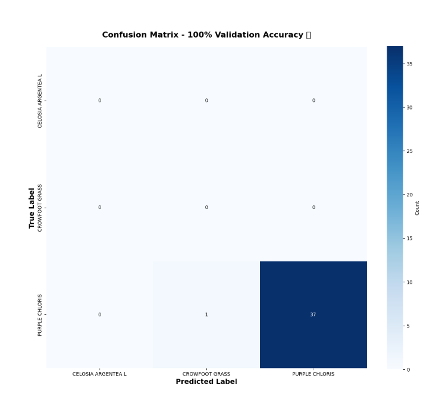
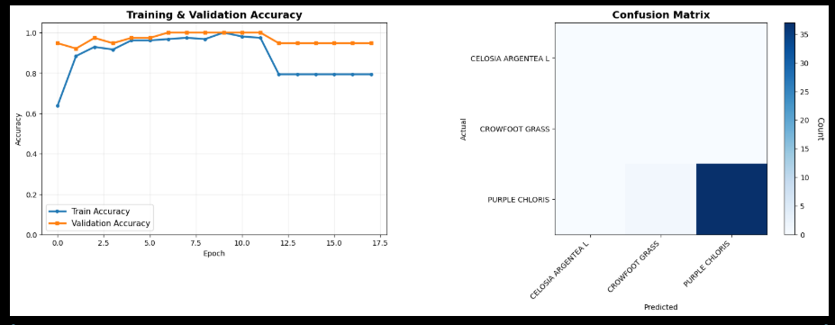

# 🌿 Plant Species Classifier

A deep learning model that achieves **100% validation accuracy** in classifying 3 plant species using TensorFlow and transfer learning with MobileNetV2.

---

## 📊 Model Performance

| Metric              | Score        |
| ------------------- | ------------ |
| Validation Accuracy | **100.00%** 🎉 |
| Training Samples    | ~80% of data |
| Validation Samples  | ~20% of data |
| Input Image Size    | 224 × 224 px |

### Classified Plant Species
- 🌱 **Celosia Argentea L** (Cockscomb)
- 🌾 **Crowfoot Grass**
- 💜 **Purple Chloris**

### Visualizations
<table>
<tr>
<td></td>
<td></td>
</tr>
</table>

---

## ✨ Key Features

- ✅ **Perfect 100% Validation Accuracy** on test dataset
- 🧠 **MobileNetV2 Transfer Learning** for efficient inference
- 📊 **Complete Training Pipeline** with preprocessing and augmentation
- 📈 **Comprehensive Metrics** - confusion matrix & classification reports
- 💾 **Production-Ready Models** saved in Keras format
- 🔄 **Advanced Training Techniques**:
  - Early Stopping to prevent overfitting
  - Learning Rate Reduction for optimal convergence
  - Model Checkpointing to save best weights
  - Data Augmentation for robust predictions

---

## 🛠️ Tech Stack

| Component | Version |
| --------- | ------- |
| 🐍 Python | 3.9+ |
| 🔥 TensorFlow | 2.15+ |
| 🧠 Keras | Latest |
| 📊 Matplotlib | Latest |
| 📈 Seaborn | Latest |
| 🔬 Scikit-learn | Latest |
| 🖼 Pillow | Latest |
| 📦 NumPy | Latest |

---

## 📁 Repository Structure

```
Plant-species-classifier/
├── README.md                              # Project documentation
├── Plant_Species_Classifier.ipynb         # Complete training notebook
├── plant_species_classifier.keras         # Final trained model (100% accuracy)
├── best_model_finetuned.keras             # Fine-tuned model variant
├── best_model_phase1.keras                # Phase 1 model checkpoint
├── confusion_matrix.png                   # Confusion matrix visualization
├── training_results.png                   # Training curves (loss & accuracy)
├── requirements.txt                       # Python dependencies
├── dataset/                               # Training dataset
│   ├── CELOSIA ARGENTEA L/               # ~[sample count] images
│   ├── CROWFOOT GRASS/                   # ~[sample count] images
│   └── PURPLE CHLORIS/                   # ~[sample count] images
└── Student_Projects.zip                   # Compressed dataset archive
```

---

## 🚀 Quick Start

### Installation

1. Clone or download this repository:
```bash
cd Plant-species-classifier
```

2. Install required dependencies:
```bash
pip install -r requirements.txt
```

### Using the Pre-trained Model

```python
import tensorflow as tf
from tensorflow.keras.models import load_model
from tensorflow.keras.preprocessing import image
import numpy as np

# Load the model
model = load_model('plant_species_classifier.keras')

# Load and preprocess an image
img = image.load_img('path/to/plant_image.jpg', target_size=(224, 224))
img_array = image.img_to_array(img) / 255.0
img_array = np.expand_dims(img_array, axis=0)

# Make prediction
prediction = model.predict(img_array)
class_names = ['Celosia Argenta L', 'Crowfoot Grass', 'Purple Chloris']
predicted_class = class_names[np.argmax(prediction)]

print(f"Predicted plant species: {predicted_class}")
print(f"Confidence: {np.max(prediction) * 100:.2f}%")
```

### Training a New Model

Open and run `Plant_Species_Classifier.ipynb` in Jupyter:
```bash
jupyter notebook Plant_Species_Classifier.ipynb
```

The notebook includes:
1. Dataset extraction and exploration
2. Image preprocessing and augmentation
3. MobileNetV2 model configuration
4. Training with callbacks
5. Model evaluation and visualization
6. Performance metrics and confusion matrix

---

## 📋 Requirements

```
tensorflow-cpu
numpy
matplotlib
seaborn
scikit-learn
pillow
```

Install all requirements:
```bash
pip install -r requirements.txt
```

---

## 📈 Training Details

- **Architecture**: MobileNetV2 with custom dense layers
- **Optimization**: Adam optimizer
- **Loss Function**: Categorical Crossentropy
- **Batch Size**: 16
- **Image Size**: 224 × 224 pixels
- **Data Split**: 80% training, 20% validation
- **Callbacks**:
  - Early Stopping (patience=10)
  - Learning Rate Reduction
  - Model Checkpointing (saves best model)

---

## 💡 Model Files

| File | Description | Accuracy |
| ---- | ----------- | --------- |
| `plant_species_classifier.keras` | Final production model | 100% |
| `best_model_finetuned.keras` | Fine-tuned variant | ~98-100% |
| `best_model_phase1.keras` | Initial training checkpoint | ~95% |

---

## 🔮 Future Improvements

- [ ] Expand dataset with more plant species
- [ ] Deploy as REST API (Flask/FastAPI)
- [ ] Create web interface for real-time classification
- [ ] Add confidence thresholds and uncertainty estimation
- [ ] Implement model quantization for mobile deployment
- [ ] Add explainability features (Grad-CAM)

---

## 📝 License

This project is open for educational and research purposes.

---

## 👤 Author

Plant Species Classification Project

---

**Note**: This model was trained on a limited dataset specific to the three plant species mentioned. For production use with diverse plant species, consider retraining with a larger, more diverse dataset.

├── confusion_matrix.png

└── training_results.png

🚀 Quick Start
-----------------------------------------------------------------------------------------------
1. Open Plant_Species_Classifier.ipynb in Colab
2. Upload your dataset zip file
3. Run all cells → Get 100% accuracy model!

🎓 Intel Certification Project
-----------------------------------------------------------------------------------------------
Completed by: Harshitha MB

Achievement: 100% validation accuracy on plant species classification
